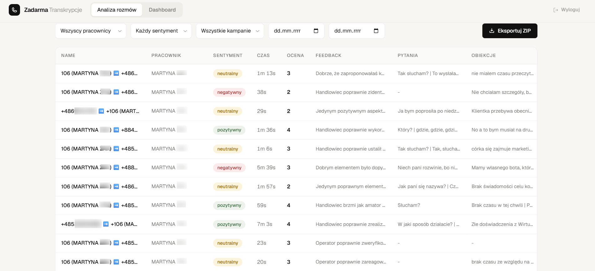
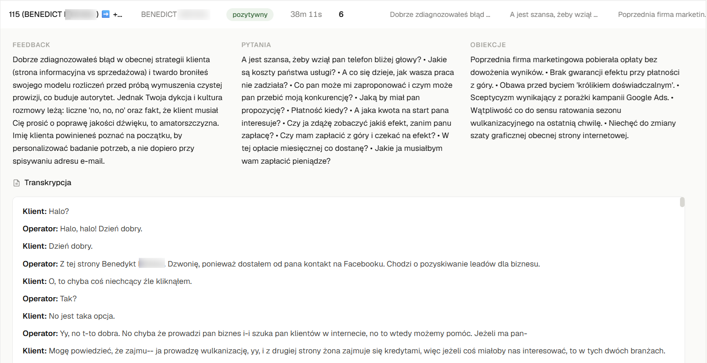
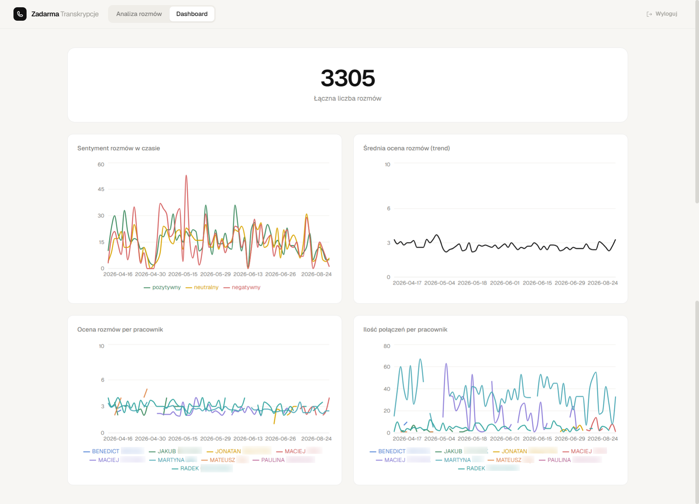
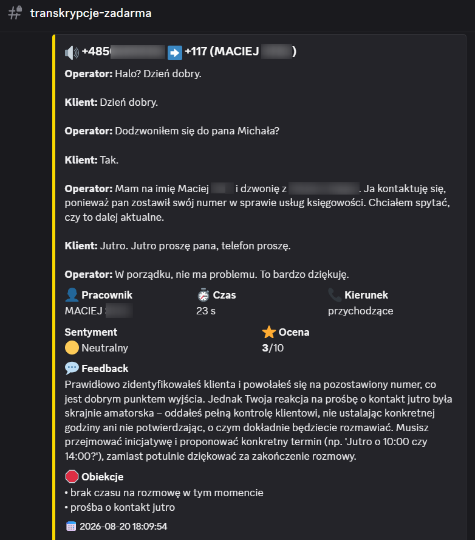
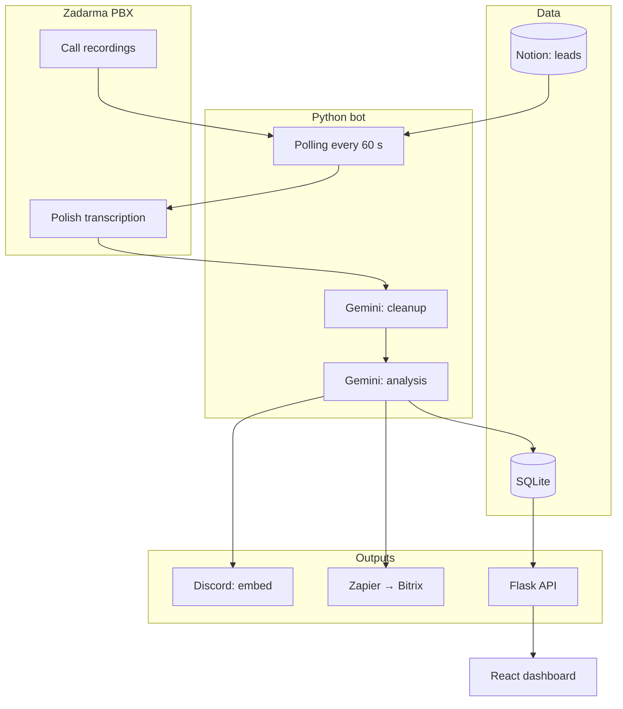

<p align="center"></p>

<h1 align="center">Zadarma Transcripts</h1>

<h3 align="center">Automated QA for call center conversations. The PBX records, AI transcribes, cleans and scores, and management sees the result on Discord and in a dashboard.</h3>

<p align="center">
  
  
  
  
  
  
</p>

---

## Table of contents

- [About](#about)
- [Screenshots](#screenshots)
- [Source code](#source-code)
- [Stack](#stack)
- [Features](#features)
- [Architecture](#architecture)
- [Statistics](#statistics)
- [Contact](#contact)

---

## About

The agency runs a call center: agents call leads, both its own and its clients' (lead prequalification as a service). Recordings piled up in the PBX panel and nobody listened to them. The team lead and the board had no visibility into what happens in calls: the sentiment, which calls went badly and where an agent could use coaching.

Every minute the bot asks the PBX for new recordings. The PBX transcribes the call word by word (two stereo channels: operator and client), the bot rebuilds the dialogue, and Gemini cleans and scores it: sentiment, a 1-10 score, feedback, client questions, objections. The result lands as a Discord embed and in the dashboard's CRM table. The team lead filters, sorts and exports transcripts to ZIP for further analysis, and the board gets an aggregated top-down view: sentiment and score charts per agent.

In production since November 2025. Calls from own-brand campaign leads skip scoring and go straight to the responsible agent's channel, and selected numbers get a summary pushed to Bitrix. Two migrations inside: from IMAP mail (AI guessed conversation turns and mixed up roles) to the PBX API, and from ClickUp to a dedicated SQLite database and React dashboard.

---

## Screenshots

| CRM table with scores | Expanded call row |
|:---:|:---:|
|  |  |

| Dashboard with charts | Discord embed |
|:---:|:---:|
|  |  |

> **Note:** screenshots come from production. Phone numbers, names and call contents are blurred.

---

## Source code

The code is private and confidential (an internal agency system). This repository documents the project: description, architecture and working screenshots.

---

## Stack

### Pipeline (Python 3.11)

```
Zadarma REST API              // recordings + transcription (word timestamps, stereo channels)
Gemini 2.5 Flash-Lite         // junk filter, dialogue cleanup, summaries
Gemini 3 Flash (thinking)     // sales analysis: sentiment, score, objections
SQLite (WAL)                  // calls + lead cache, deduplication by call_id
```

### API and dashboard

```
Flask 3                       // 6 endpoints, HMAC token keyed by day
React 19 + Vite 6 + TS        // CRM table, filters, ZIP export
Tailwind 3 + Recharts         // sentiment and score charts
```

### Integrations

```
Discord webhooks              // scored embed, routing to agent channels
Notion API                    // lead database sync every 15 minutes
Zapier → Bitrix               // summaries of selected calls
SMTP2GO                       // e-mail alerts
```

### Operations

```
Docker Compose on a VPS       // single service, volume for the database
Netlify                       // dashboard hosting
release-prod.sh               // push → pull-deploy with backup and rollback
```

---

## Features

### Call pipeline

- **Polling every 60 s** - the bot fetches only recordings newer than the last success, no duplicates in the database
- **Dialogue reconstruction** - words from both stereo channels sorted by time, turns of the same speaker merged; operator and client told apart by channel
- **Call direction** - detected from the internal SIP number, resilient to display names in the caller ID
- **Junk filter** - Gemini rejects voicemails, carrier messages, monologues and transcription artifacts; only clean dialogue moves on
- **Sales analysis** - sentiment, 1-10 score, feedback, questions and objections; the prompt is deliberately demanding (an average call = 5/10)

### Routing and integrations

- **Discord embed** - frame color follows sentiment, fields: agent, direction, score, feedback, transcript
- **Own-brand campaign leads** - no scoring, straight to the responsible agent's channel; the lead database syncs from Notion every 15 minutes, the hot path reads a local cache
- **Bitrix summaries** - selected numbers get a call summary (max 500 chars) via Zapier

### Dashboard

- **CRM table** - filters (agent, sentiment, campaign, dates), column sorting, pagination
- **Row expansion** - feedback, questions, objections and the full Operator/Client transcript
- **Charts** - sentiment and average score over time, score and call count per agent
- **ZIP export** - one file per call plus a combined file, up to 5000 calls

### Operations

- **Health and heartbeat** - health endpoint plus an e-mail alert when the bot goes silent (24 h cooldown)
- **Key rotation alert** - a separate template for HTTP 401 from the PBX, with instructions
- **Test mode** - DRY_RUN logs instead of sending, optional call limit
- **One-command deploy** - push, then on the server: backup, build, healthcheck, rollback on failure

---

## Architecture



---

## Statistics

### Technical complexity

| Metric | Value |
|---|---|
| **Commits** | 22 (2025-11 - 2026-08) |
| **Authors** | 1 |
| **Lines of code** | 3,070 (2,456 Python + 614 React/TS) |
| **HTTP endpoints** | 6 |
| **SQLite tables** | 2 (+3 indexes) |
| **Gemini models** | 2 (cleanup + analysis) |
| **Services** | bot (Docker on VPS) + dashboard (Netlify) |

### Feature overview

| Category | Highlights |
|---|---|
| **Pipeline** | polling, dialogue reconstruction, junk filter, sales analysis |
| **Routing** | Discord embed, agent channels, Bitrix via Zapier |
| **Dashboard** | CRM with filters, charts, ZIP export |
| **Operations** | heartbeat, key rotation alert, deploy with rollback |

---

## Contact

| Platform | Link |
|---|---|
| **WWW** | [kamilkaczmareksolutions.com](https://kamilkaczmareksolutions.com) |
| **GitHub** | [kamilkaczmareksolutions](https://github.com/kamilkaczmareksolutions) |
| **LinkedIn** | [Kamil Kaczmarek](https://www.linkedin.com/in/kamilkaczmareksolutions) |
| **Email** | [recruitment@kamilkaczmareksolutions.com](mailto:recruitment@kamilkaczmareksolutions.com) |

---

**Zadarma Transcripts** - every sales call scored, not just recorded.

<p align="center"><em>Built by Kamil Kaczmarek</em></p>
