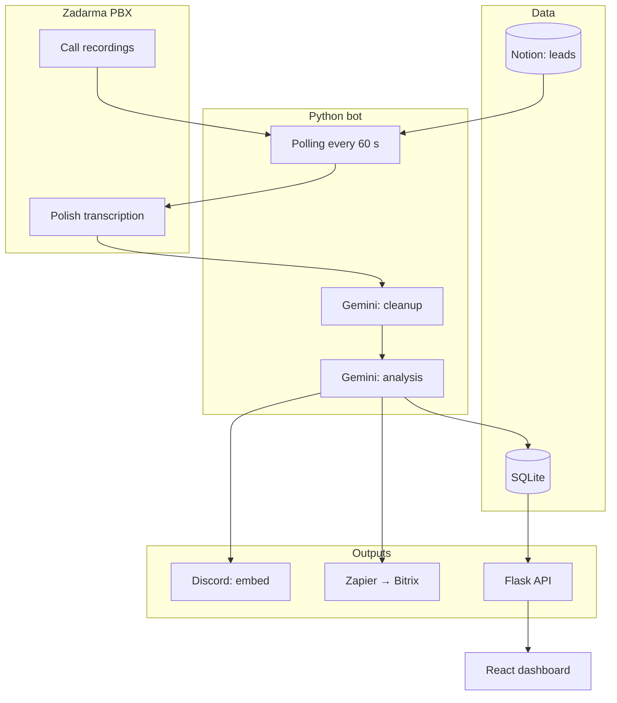

<p align="center"></p>

<h1 align="center">Zadarma Transcripts</h1>

<h3 align="center">Scores every sales call in your call center and gives managers and leadership a clear quality report.</h3>

<p align="center">
  
  
  
  
  
  
</p>

---

## Table of contents

- [About](#about)
- [Screenshots](#screenshots)
- [Source code](#source-code)
- [Stack](#stack)
- [Features](#features)
- [Architecture](#architecture)
- [Statistics](#statistics)
- [Contact](#contact)

---

## About

The agency runs a call center: agents dial leads for the agency and its clients (lead prequalification as a service). Recordings piled up in the phone system panel, but nobody listened to them. The team lead and the board had no view into call quality: the tone of conversations, which calls went badly, and where an agent needed coaching.

Every minute the system pulls new recordings, rebuilds the dialogue between agent and client, cleans it and scores it: sentiment, a 1-10 rating, feedback, client questions and objections. The result appears on Discord as a readable report and in a CRM table. The team lead filters, sorts and exports transcripts to ZIP. The board gets an aggregated view: sentiment and score charts per agent.

In production since November 2025. Calls from the agency's own campaigns skip full scoring and go straight to the responsible agent's channel. Selected numbers get a short summary in the client's sales CRM. During development the team moved from fetching recordings via email (the model often mixed up speakers) to direct pull from the phone system, and from an external task tool to a dedicated CRM dashboard.

---

## Screenshots

| Call list with scores | Single call details |
|:---:|:---:|
|  |  |

| Team quality overview | Manager notification on Discord |
|:---:|:---:|
|  |  |

> **Note:** screenshots come from production. Phone numbers, names and call contents are blurred.

---

## Source code

The code is private and confidential (an internal agency system). This repository documents the project: description, architecture and working screenshots.

---

## Stack

### Pipeline (Python 3.11)

```
Zadarma REST API              // recordings + transcription (word timestamps, stereo channels)
Gemini 2.5 Flash-Lite         // junk filter, dialogue cleanup, summaries
Gemini 3 Flash (thinking)     // sales analysis: sentiment, score, objections
SQLite (WAL)                  // calls + lead cache, deduplication by call_id
```

### API and dashboard

```
Flask 3                       // 6 endpoints, HMAC token keyed by day
React 19 + Vite 6 + TS        // CRM table, filters, ZIP export
Tailwind 3 + Recharts         // sentiment and score charts
```

### Integrations

```
Discord webhooks              // scored embed, routing to agent channels
Notion API                    // lead database sync every 15 minutes
Zapier → Bitrix               // summaries of selected calls
SMTP2GO                       // e-mail alerts
```

### Operations

```
Docker Compose on a VPS       // single service, volume for the database
Netlify                       // dashboard hosting
release-prod.sh               // push → pull-deploy with backup and rollback
```

---

## Features

### Call processing

- **Automatic recording pickup** - checks for new calls every minute, no duplicates. The team lead does not trigger anything manually
- **Dialogue reconstruction** - turns a recording into a readable conversation: who said what, agent vs client. The basis for a fair score
- **Call direction detection** - knows whether the team dialed out or answered inbound. Scoring and routing depend on context
- **Noise filtering** - drops voicemails, carrier messages and artifacts. Only a real sales conversation gets scored
- **Sales scoring** - sentiment, 1-10 rating, concrete feedback, client questions and objections. An average call is 5/10, not an inflated 8/10

### Delivering results

- **Discord report** - the team lead sees the score immediately, without opening the panel. Color and fields flag calls that need attention
- **Agency's own campaigns** - calls from in-house leads go straight to the agent, without full analysis. The lead database syncs regularly so routing stays accurate
- **Summary in the client's CRM** - selected numbers get a short call summary in the client's sales system

### Management panel

- **CRM table** - filters by agent, sentiment, campaign and dates. A call set you can review in minutes
- **Call details** - one click: feedback, questions, objections, full transcript
- **Charts for leadership** - sentiment and average score over time, agent comparison. A top-down view of team quality
- **Export for review** - a bundle of transcripts for coaching or further analysis

### Reliability

- **Uptime monitoring** - e-mail alert when the system stops processing calls. Failures do not go unnoticed
- **Access expiry alert** - a separate message with instructions when the phone system rejects the connection. Fast response without digging through logs
- **Test mode** - runs the pipeline without sending results. Safe rollout of changes
- **Deploy with rollback** - one command: backup, build, health check, revert on failure

---

## Architecture



---

## Statistics

### Technical complexity

| Metric | Value |
|---|---|
| **Commits** | 22 (2025-11 - 2026-08) |
| **Authors** | 1 |
| **Lines of code** | 3,070 (2,456 Python + 614 React/TS) |
| **HTTP endpoints** | 6 |
| **SQLite tables** | 2 (+3 indexes) |
| **Gemini models** | 2 (cleanup + analysis) |
| **Services** | bot (Docker on VPS) + dashboard (Netlify) |

### Feature overview

| Category | Highlights |
|---|---|
| **Call processing** | recording pickup, dialogue, noise filter, sales scoring |
| **Delivering results** | Discord, agent channels, client CRM |
| **Management panel** | filtered list, charts, export |
| **Reliability** | monitoring, alerts, deploy with rollback |

---

## Contact

| Platform | Link |
|---|---|
| **WWW** | [kamilkaczmareksolutions.com](https://kamilkaczmareksolutions.com) |
| **GitHub** | [kamilkaczmareksolutions](https://github.com/kamilkaczmareksolutions) |
| **LinkedIn** | [Kamil Kaczmarek](https://www.linkedin.com/in/kamilkaczmareksolutions) |
| **Email** | [recruitment@kamilkaczmareksolutions.com](mailto:recruitment@kamilkaczmareksolutions.com) |

---

**Zadarma Transcripts** - every sales call scored, not just recorded.

<p align="center"><em>Built by Kamil Kaczmarek</em></p>
