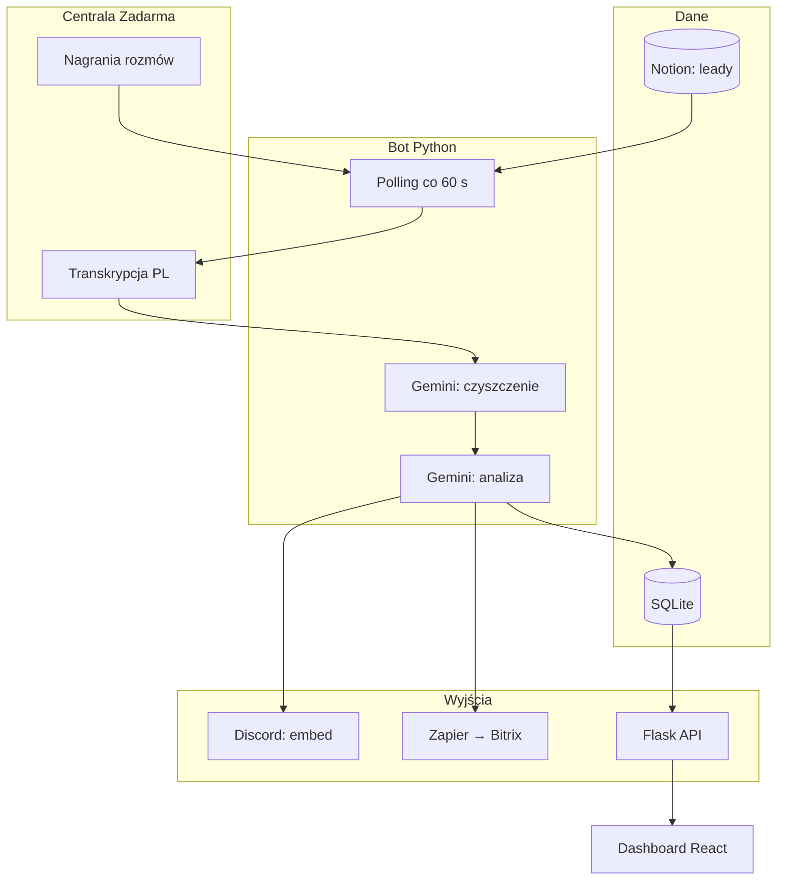

<p align="center"></p>

<h1 align="center">Transkrypcje Zadarma</h1>

<h3 align="center">Automatyczny QA rozmów call center. Centrala nagrywa, AI transkrybuje, czyści i ocenia, a kierownictwo widzi wynik na Discordzie i w dashboardzie.</h3>

<p align="center">
  
  
  
  
  
  
</p>

---

## Spis treści

- [O projekcie](#o-projekcie)
- [Screenshoty](#screenshoty)
- [Kod źródłowy](#kod-źródłowy)
- [Stack](#stack)
- [Funkcje](#funkcje)
- [Architektura](#architektura)
- [Statystyki](#statystyki)
- [Kontakt](#kontakt)

---

## O projekcie

Agencja prowadzi call center: pracownicy obdzwaniają leady, własne i klientów (prekwalifikacja leadów jako usługa). Nagrania lądowały w panelu centrali i nikt ich nie słuchał. Kierownik zespołu i zarząd nie widzieli, co dzieje się w rozmowach: jaki jest sentyment, które rozmowy nie poszły i z czym pracownik mógłby się podszkolić.

Co minutę bot pyta centralę o nowe nagrania. Centrala transkrybuje rozmowę z dokładnością do słowa (dwa kanały stereo: operator i klient), bot składa z tego dialog, a Gemini go czyści i ocenia: sentyment, ocena 1-10, feedback, pytania klienta, obiekcje. Wynik ląduje jako embed na Discordzie i w tabeli CRM dashboardu. Kierownik filtruje, sortuje i eksportuje transkrypty do ZIP celem dalszej analizy, a zarząd dostaje zagregowany rzut z góry: wykresy sentymentu i ocen per pracownik.

System działa na produkcji od listopada 2025. Rozmowy z leadami kampanii marki własnej omijają analizę i trafiają prosto na kanały odpowiedzialnych agentów, a wybrane numery dostają podsumowanie do Bitrix. Wewnątrz dwie migracje: z maili IMAP na API centrali (AI zgadywało tury rozmów i myliło role) oraz z ClickUp na własny SQLite i React.

---

## Screenshoty

| Tabela CRM z ocenami | Rozwinięty wiersz rozmowy |
|:---:|:---:|
|  |  |

| Dashboard z wykresami | Embed na Discordzie |
|:---:|:---:|
|  |  |

> **Nota:** screenshoty pochodzą z produkcji. Numery telefonów, nazwiska i treści rozmów są zamazane.

---

## Kod źródłowy

Kod jest prywatny i poufny (system wewnętrzny agencji). To repo dokumentuje projekt: opis, architekturę i zrzuty działania.

---

## Stack

### Pipeline (Python 3.11)

```
Zadarma REST API              // nagrania + transkrypcja (słowa z timestampami, kanały stereo)
Gemini 2.5 Flash-Lite         // filtr śmieci, czyszczenie dialogu, podsumowania
Gemini 3 Flash (thinking)     // analiza sprzedażowa: sentyment, ocena, obiekcje
SQLite (WAL)                  // rozmowy + cache leadów, deduplikacja po call_id
```

### API i dashboard

```
Flask 3                       // 6 endpointów, token HMAC kluczowany dniem
React 19 + Vite 6 + TS        // tabela CRM, filtry, eksport ZIP
Tailwind 3 + Recharts         // wykresy sentymentu i ocen
```

### Integracje

```
Discord webhooks              // embed z oceną, routing na kanały agentów
Notion API                    // sync bazy leadów co 15 minut
Zapier → Bitrix               // podsumowanie wybranych rozmów
SMTP2GO                       // alerty e-mail
```

### Operacje

```
Docker Compose na VPS         // jeden serwis, volume na bazę
Netlify                       // hosting dashboardu
release-prod.sh               // push → pull-deploy z backupem i rollbackiem
```

---

## Funkcje

### Pipeline rozmów

- **Polling co 60 s** - bot zbiera z centrali tylko nagrania od ostatniego sukcesu, bez duplikatów w bazie
- **Rekonstrukcja dialogu** - słowa z obu kanałów stereo sortowane po czasie, tury tego samego mówcy scalane; operator i klient rozróżnieni po kanale
- **Kierunek rozmowy** - wykrywany po numerze wewnętrznym SIP, odporny na display name w identyfikatorze
- **Filtr śmieci** - Gemini odrzuca skrzynki pocztowe, komunikaty operatora, monologi i artefakty transkrypcji; czysty dialog trafia dalej
- **Analiza sprzedażowa** - sentyment, ocena 1-10, feedback, pytania i obiekcje; prompt celowo wymagający (przeciętna rozmowa = 5/10)

### Routing i integracje

- **Embed na Discordzie** - kolor ramki zależny od sentymentu, pola: pracownik, kierunek, ocena, feedback, transkrypcja
- **Leady kampanii marki własnej** - bez analizy, prosto na kanał odpowiedzialnego agenta; baza leadów syncuje się z Notion co 15 minut, hot path czyta lokalny cache
- **Podsumowania do Bitrix** - wybrane numery dostają podsumowanie rozmowy (max 500 znaków) przez Zapier

### Dashboard

- **Tabela CRM** - filtry (pracownik, sentyment, kampania, daty), sortowanie kolumn, paginacja
- **Rozwinięcie wiersza** - feedback, pytania, obiekcje i pełny transkrypt Operator/Klient
- **Wykresy** - sentyment i średnia ocena w czasie, ocena i liczba rozmów per pracownik
- **Eksport ZIP** - jeden plik na rozmowę plus zbiorczy, do 5000 rozmów

### Operacje

- **Health i heartbeat** - endpoint zdrowia plus alert e-mail, gdy bot milczy (cooldown 24 h)
- **Alert rotacji kluczy** - osobny szablon przy HTTP 401 z centrali, z instrukcją
- **Tryb testowy** - DRY_RUN loguje zamiast wysyłać, limit rozmów do przetworzenia
- **Deploy jedną komendą** - push, potem na serwerze: backup, build, healthcheck, rollback przy awarii

---

## Architektura



---

## Statystyki

### Złożoność techniczna

| Metryka | Wartość |
|---|---|
| **Commity** | 22 (2025-11 - 2026-08) |
| **Autorzy** | 1 |
| **Linie kodu** | 3070 (2456 Python + 614 React/TS) |
| **Endpointy HTTP** | 6 |
| **Tabele SQLite** | 2 (+3 indeksy) |
| **Modele Gemini** | 2 (czyszczenie + analiza) |
| **Usługi** | bot (Docker na VPS) + dashboard (Netlify) |

### Przegląd funkcji

| Kategoria | Najważniejsze |
|---|---|
| **Pipeline** | polling, rekonstrukcja dialogu, filtr śmieci, analiza sprzedażowa |
| **Routing** | embed Discord, kanały agentów, Bitrix przez Zapier |
| **Dashboard** | CRM z filtrami, wykresy, eksport ZIP |
| **Operacje** | heartbeat, alert rotacji kluczy, deploy z rollbackiem |

---

## Kontakt

| Platforma | Link |
|---|---|
| **WWW** | [kamilkaczmareksolutions.com](https://kamilkaczmareksolutions.com) |
| **GitHub** | [kamilkaczmareksolutions](https://github.com/kamilkaczmareksolutions) |
| **LinkedIn** | [Kamil Kaczmarek](https://www.linkedin.com/in/kamilkaczmareksolutions) |
| **Email** | [recruitment@kamilkaczmareksolutions.com](mailto:recruitment@kamilkaczmareksolutions.com) |

---

**Transkrypcje Zadarma** - każda rozmowa handlowca oceniona, nie tylko zapisana.

<p align="center"><em>Zbudował Kamil Kaczmarek</em></p>
