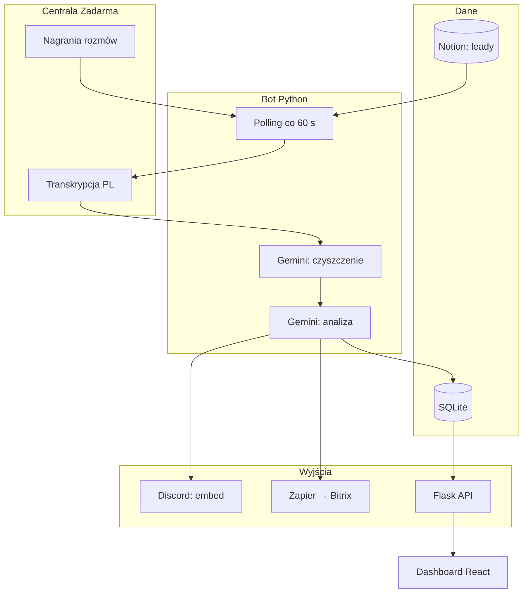

<p align="center"></p>

<h1 align="center">Transkrypcje Zadarma</h1>

<h3 align="center">Ocenia każdą rozmowę handlowca w call center i daje kierownikom oraz zarządowi czytelny raport jakości.</h3>

<p align="center">
  
  
  
  
  
  
</p>

---

## Spis treści

- [O projekcie](#o-projekcie)
- [Screenshoty](#screenshoty)
- [Kod źródłowy](#kod-źródłowy)
- [Stack](#stack)
- [Funkcje](#funkcje)
- [Architektura](#architektura)
- [Statystyki](#statystyki)
- [Kontakt](#kontakt)

---

## O projekcie

Agencja prowadzi call center: pracownicy obdzwaniają leady własne i klientów (prekwalifikacja jako usługa). Nagrania gromadziły się w panelu centrali, ale nikt ich nie odsłuchiwał. Kierownik zespołu i zarząd nie widzieli, jaka była atmosfera rozmów, które poszły źle i czego agent potrzebuje w coachingu.

System co minutę pobiera nowe nagrania, składa z nich dialog między handlowcem a klientem, czyści go i ocenia: sentyment, punktację 1-10, feedback, pytania i obiekcje. Wynik trafia na Discord jako czytelny raport oraz do panelu CRM. Kierownik filtruje, sortuje i eksportuje transkrypty do ZIP. Zarząd dostaje zagregowany widok: wykresy sentymentu i ocen per pracownik.

System działa na produkcji od listopada 2025. Rozmowy z kampanii marki własnej omijają scoring i idą prosto na kanał odpowiedzialnego agenta. Wybrane numery dostają podsumowanie w CRM klienta. W toku rozwoju przeszliśmy z pobierania nagrań z maili (model często mylił mówców) na bezpośrednie pobieranie z centrali oraz z zewnętrznego narzędzia do zadań na własny panel CRM.

---

## Screenshoty

| Lista rozmów z ocenami | Szczegóły pojedynczej rozmowy |
|:---:|:---:|
|  |  |

| Podsumowanie jakości zespołu | Powiadomienie dla kierownika na Discordzie |
|:---:|:---:|
|  |  |

> **Nota:** screenshoty pochodzą z produkcji. Numery telefonów, nazwiska i treści rozmów są zamazane.

---

## Kod źródłowy

Kod jest prywatny i poufny (system wewnętrzny agencji). To repo dokumentuje projekt: opis, architekturę i zrzuty działania.

---

## Stack

### Pipeline (Python 3.11)

```
Zadarma REST API              // nagrania + transkrypcja (słowa z timestampami, kanały stereo)
Gemini 2.5 Flash-Lite         // filtr śmieci, czyszczenie dialogu, podsumowania
Gemini 3 Flash (thinking)     // analiza sprzedażowa: sentyment, ocena, obiekcje
SQLite (WAL)                  // rozmowy + cache leadów, deduplikacja po call_id
```

### API i dashboard

```
Flask 3                       // 6 endpointów, token HMAC kluczowany dniem
React 19 + Vite 6 + TS        // tabela CRM, filtry, eksport ZIP
Tailwind 3 + Recharts         // wykresy sentymentu i ocen
```

### Integracje

```
Discord webhooks              // embed z oceną, routing na kanały agentów
Notion API                    // sync bazy leadów co 15 minut
Zapier → Bitrix               // podsumowanie wybranych rozmów
SMTP2GO                       // alerty e-mail
```

### Operacje

```
Docker Compose na VPS         // jeden serwis, volume na bazę
Netlify                       // hosting dashboardu
release-prod.sh               // push → pull-deploy z backupem i rollbackiem
```

---

## Funkcje

### Przetwarzanie rozmów

- **Automatyczne zbieranie nagrań** - co minutę łapie tylko nowe rozmowy, bez duplikatów. Kierownik nie musi nic uruchamiać ręcznie
- **Odtworzenie dialogu** - składa z nagrania czytelny przebieg rozmowy: kto co powiedział, handlowiec vs klient. To podstawa sensownej oceny
- **Rozpoznanie kierunku rozmowy** - wie, czy oddzwanialiśmy, czy odbieraliśmy. Ocena i routing zależą od kontekstu
- **Odfiltrowanie szumu** - odrzuca poczty głosowe, komunikaty operatora i artefakty. Do oceny trafia tylko realna rozmowa handlowa
- **Ocena sprzedażowa** - sentyment, punktacja 1-10, konkretny feedback, lista pytań klienta i obiekcji. Średnia rozmowa to 5/10, nie 8/10 z dołu

### Dostarczanie wyników

- **Raport na Discordzie** - kierownik widzi ocenę od razu, bez wchodzenia w panel. Kolor i pola mówią, czy rozmowa wymaga uwagi
- **Własne kampanie agencji** - rozmowy z leadów własnych trafiają prosto do agenta, bez pełnej analizy. Baza leadów synchronizuje się regularnie, żeby routing był trafny
- **Podsumowanie w CRM klienta** - wybrane numery dostają krótkie podsumowanie rozmowy w systemie sprzedażowym klienta

### Panel zarządzania

- **Tabela CRM** - filtry po pracowniku, sentymencie, kampanii i datach. Zestaw rozmów, które da się przejrzeć w minuty
- **Szczegóły rozmowy** - jednym kliknięciem: feedback, pytania, obiekcje, pełny transkrypt
- **Wykresy dla zarządu** - sentyment i średnia ocena w czasie, porównanie pracowników. Widok z góry na jakość zespołu
- **Eksport do analizy** - paczka transkryptów do dalszego przeglądu lub szkolenia

### Niezawodność

- **Monitoring działania** - alert e-mail, gdy system przestaje przetwarzać rozmowy. Awaria nie zostaje niezauważona
- **Alert przy wygaśnięciu dostępu** - osobna wiadomość z instrukcją, gdy centrala odrzuca połączenie. Szybka reakcja bez szukania przyczyny w logach
- **Tryb testowy** - przepuszcza proces bez wysyłania wyników. Bezpieczne wdrożenie zmian
- **Wdrożenie z rollbackiem** - jedna komenda: backup, build, sprawdzenie zdrowia, cofnięcie przy błędzie

---

## Architektura



---

## Statystyki

### Złożoność techniczna

| Metryka | Wartość |
|---|---|
| **Commity** | 22 (2025-11 - 2026-08) |
| **Autorzy** | 1 |
| **Linie kodu** | 3070 (2456 Python + 614 React/TS) |
| **Endpointy HTTP** | 6 |
| **Tabele SQLite** | 2 (+3 indeksy) |
| **Modele Gemini** | 2 (czyszczenie + analiza) |
| **Usługi** | bot (Docker na VPS) + dashboard (Netlify) |

### Przegląd funkcji

| Kategoria | Najważniejsze |
|---|---|
| **Przetwarzanie rozmów** | zbieranie nagrań, dialog, filtr szumu, ocena sprzedażowa |
| **Dostarczanie wyników** | Discord, kanały agentów, CRM klienta |
| **Panel zarządzania** | lista z filtrami, wykresy, eksport |
| **Niezawodność** | monitoring, alerty, wdrożenie z rollbackiem |

---

## Kontakt

| Platforma | Link |
|---|---|
| **WWW** | [kamilkaczmareksolutions.com](https://kamilkaczmareksolutions.com) |
| **GitHub** | [kamilkaczmareksolutions](https://github.com/kamilkaczmareksolutions) |
| **LinkedIn** | [Kamil Kaczmarek](https://www.linkedin.com/in/kamilkaczmareksolutions) |
| **Email** | [recruitment@kamilkaczmareksolutions.com](mailto:recruitment@kamilkaczmareksolutions.com) |

---

**Transkrypcje Zadarma** - każda rozmowa handlowca oceniona, nie tylko zapisana.

<p align="center"><em>Zbudował Kamil Kaczmarek</em></p>
